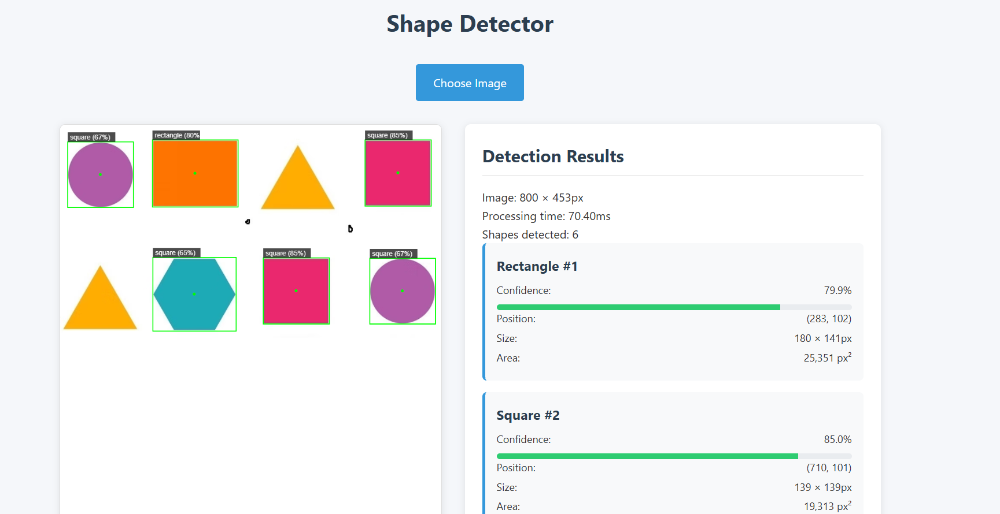
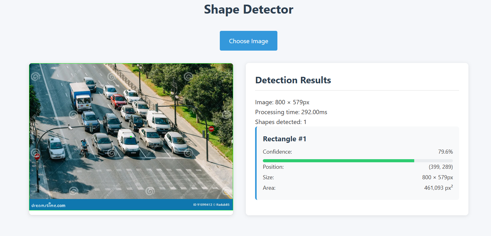
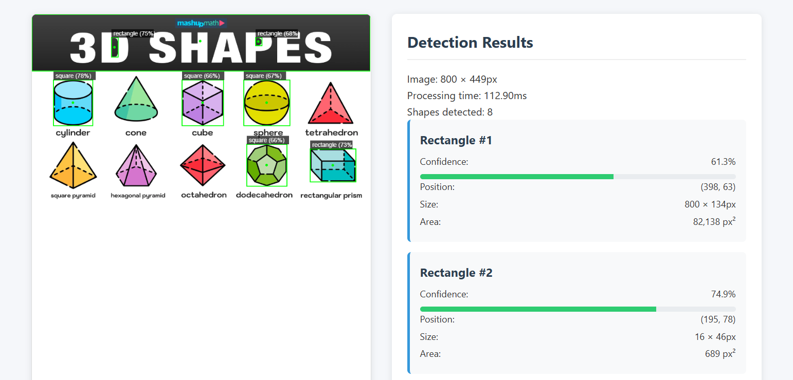
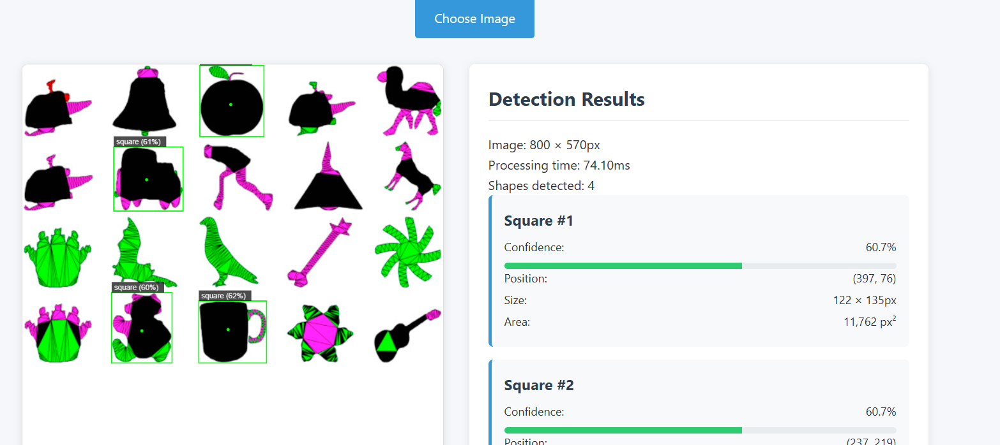

# Shape Detector

A web application that detects and classifies shapes in uploaded images using computer vision techniques. Built with TypeScript and modern web technologies, this application can identify various geometric shapes in real-time with bounding box visualization.

## Table of Contents
- [Features](#features)
- [Project Structure](#project-structure)
- [Getting Started](#getting-started)
- [How to Use](#how-to-use)
- [Technologies Used](#technologies-used)
- [Development Setup](#development-setup)
- [File Structure](#file-structure)
- [Contributing](#contributing)
- [License](#license)

## Features

- 📷 Upload any image to detect shapes
- ⚡ Real-time shape detection and classification
- 🟦 Displays bounding boxes around detected shapes
- 📊 Shows shape type and confidence level
- 🔍 Works with various shapes including circles, squares, rectangles, triangles, and pentagons
- 🎨 Clean and responsive user interface
- 🚀 Built with modern web technologies

## Screenshots:
Outputs:


### Basic Shapes Detection


### Mixed Shapes Detection


### Complex Shapes Detection


### Edge Cases


## Project Structure

```
shape-detector/
├── src/                    # Source files
│   ├── main.ts            # Main application logic
│   └── style.css          # Application styles
├── test-images/           # Sample images for testing
├── public/                # Static files
├── index.html             # Main HTML entry point
├── package.json           # Project configuration
├── tsconfig.json          # TypeScript configuration
└── vite.config.ts         # Vite configuration
```

## File Descriptions

- **main.ts**: Contains the core shape detection logic, including:
  - Image processing and canvas operations
  - Shape detection and classification
  - Bounding box calculations
  - User interface interactions

- **style.css**: Contains all the styling for the application

- **test-images/**: Contains sample images for testing the application

## Getting Started

### Prerequisites

- Node.js (v16 or higher)
- npm (v8 or higher) or Yarn
- Modern web browser (Chrome, Firefox, Edge, or Safari)

### Installation

1. Clone the repository:
   ```bash
   git clone https://github.com/ramyegneswar2990/Shape_detection.git
   cd Shape_detection
   ```

2. Install dependencies:
   ```bash
   npm install
   ```

3. Start the development server:
   ```bash
   npm run dev
   ```

4. Open your browser and navigate to `http://localhost:3000`

## How to Use

1. Click on "Choose an image" or drag and drop an image file
2. The application will process the image and detect shapes
3. View the detected shapes with bounding boxes and classification results

## Technologies Used

- **TypeScript** - For type-safe JavaScript development
- **HTML5 Canvas API** - For image processing and rendering
- **Vite** - Next Generation Frontend Tooling
- **CSS3** - For modern styling and animations
- **Git** - Version control
- **GitHub** - Hosting and collaboration

## Development Setup

1. **Clone the repository**
   ```bash
   git clone https://github.com/ramyegneswar2990/Shape_detection.git
   cd Shape_detection
   ```

2. **Install dependencies**
   ```bash
   npm install
   ```

3. **Start development server**
   ```bash
   npm run dev
   ```

4. **Build for production**
   ```bash
   npm run build
   ```

## Contributing

Contributions are what make the open-source community such an amazing place to learn, inspire, and create. Any contributions you make are **greatly appreciated**.

1. Fork the Project
2. Create your Feature Branch (`git checkout -b feature/AmazingFeature`)
3. Commit your Changes (`git commit -m 'Add some AmazingFeature'`)
4. Push to the Branch (`git push origin feature/AmazingFeature`)
5. Open a Pull Request

## License

Distributed under the MIT License. See `LICENSE` for more information.

## Acknowledgments

- [Vite](https://vitejs.dev/) - For the amazing development experience
- [TypeScript](https://www.typescriptlang.org/) - For type safety
- [GitHub](https://github.com) - For hosting the project
- [Shields.io](https://shields.io/) - For the beautiful badges

## Acknowledgments

- Built with modern web technologies
- Special thanks to the open-source community for various libraries and resources
